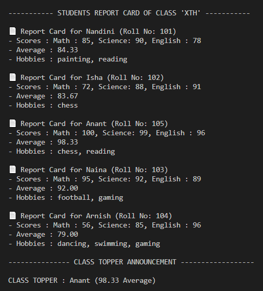

📘 Project Title: "Student Report Card Generator (Tuple-Based)"
📦 Data Structure

This is a beginner-friendly Python project that demonstrates how to use TUPLES effectively to store, unpack and process structured data. The project simulates a simple Report_Card_Generator using  a list of student records stored as TUPLES. 

Use a list of tuples to store student records:

# Format: (name, (math, science, english), roll_no, *hobbies)
students = [
    ("Alice", (85, 90, 78), 101, "painting", "reading"),
    ("Bob", (72, 88, 91), 102, "chess"),
    ("Charlie", (95, 92, 89), 103, "football", "gaming")
]

🎯 FEATURES

- Unpack each tuple to extract scores and hobbies.

- Calculate average marks.

- Generate formatted report for each student.

- Save reports to a .txt file (optional).

- Print final class summary (highest scorer, etc.).

🖥 Sample Output

📄 Report Card for Alice (Roll No: 101)
- Scores: Math: 85, Science: 90, English: 78
- Average: 84.33
- Hobbies: painting, reading

-----------------------------------

Class Topper: Charlie (92.00 average)

✅ KEY CONCEPTS ->

- Data modeling with tuples

- Tuple unpacking logic

- List comprehensions with tuples

- Nested tuple structures

- Real-world simulation (e.g., employee records, exam reports, schedule tracking)
